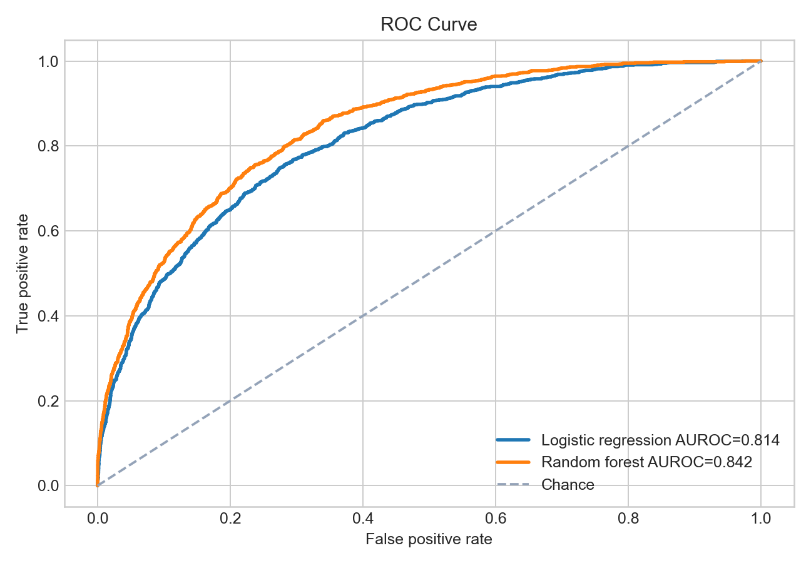
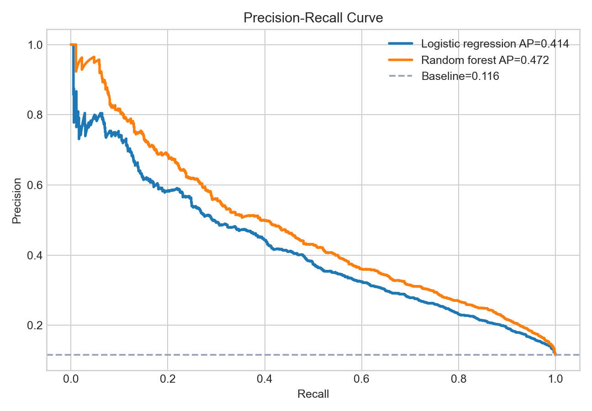
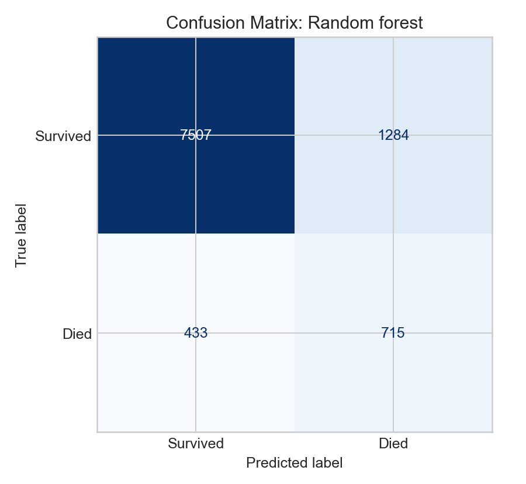
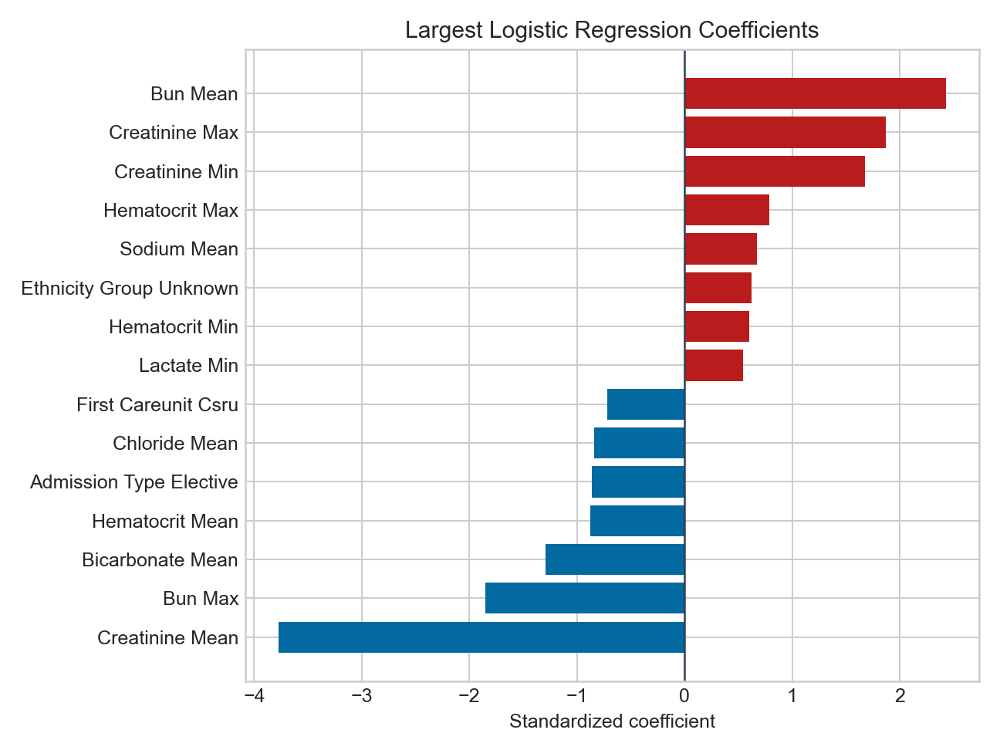
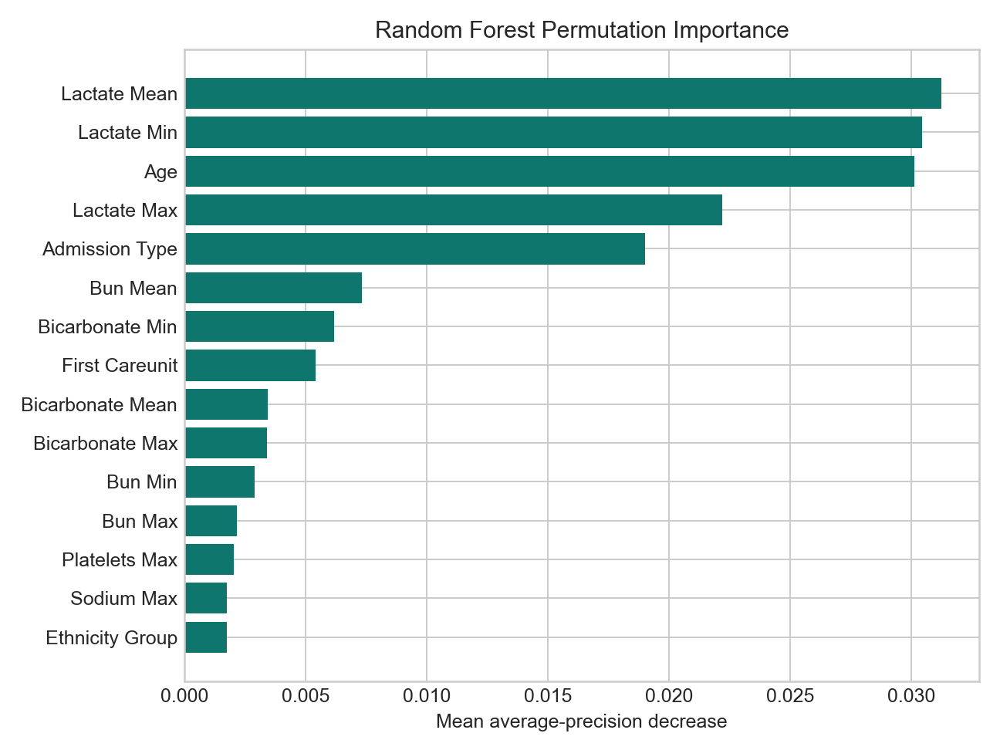

# Predicting Adult ICU Mortality with MIMIC-III

This project is a self-learning tutorial for UT Austin's AI in Healthcare coursework. It walks through a reproducible tabular machine learning workflow on protected MIMIC-III v1.4 data to predict adult in-hospital mortality after an ICU admission.

The goal is educational: define a cohort, prevent leakage, engineer first-24-hour features, compare imbalanced classifiers, and interpret model behavior. This is not a clinical decision tool.

## Results

- Cohort size: 49,695 adult ICU admissions
- Mortality count: 5,739
- Mortality rate: 11.55%
- Best model by average precision: Random forest
- Random forest performance: AUROC 0.842, average precision 0.472

The plots below summarize the model behavior and interpretation on the held-out test set.

The ROC and precision-recall curves show that the model separates survivors from non-survivors better than chance on an imbalanced outcome.

The confusion matrix shows the classification tradeoff at the tutorial's default threshold.

The final plots show which inputs contributed most to the fitted models.

<table>
  <tr>
    <td align="center">
      
      <br><sub>ROC: discrimination above chance.</sub>
    </td>
    <td align="center">
      
      <br><sub>PR: better context for imbalanced outcomes.</sub>
    </td>
  </tr>
  <tr>
    <td align="center">
      
      <br><sub>Confusion matrix: threshold tradeoff at 0.5.</sub>
    </td>
    <td align="center">
      
      <br><sub>Logistic model: strongest directional associations.</sub>
    </td>
  </tr>
  <tr>
    <td colspan="2" align="center">
      
      <br><sub>Random forest: most influential predictors by permutation importance.</sub>
    </td>
  </tr>
</table>

## What’s Included

- [MIMIC_III_Mortality_ML_Tutorial.ipynb](./MIMIC_III_Mortality_ML_Tutorial.ipynb): step-by-step tutorial notebook
- [mimic_mortality_tutorial.py](./mimic_mortality_tutorial.py): reusable Python pipeline for feature building, training, and evaluation
- [MIMIC_III_Mortality_ML_Tutorial.pdf](./MIMIC_III_Mortality_ML_Tutorial.pdf): exported tutorial PDF
- `mimic_mortality_artifacts/`: derived features, metrics, and figures generated by the pipeline, including:
  - `roc_curve.png`
  - `precision_recall_curve.png`
  - `confusion_matrix.png`
  - `logistic_coefficients.png`
  - `rf_permutation_importance.png`

## Quickstart

1. Place the MIMIC-III v1.4 CSV files under:
   `Datasets/mimiciii/1.4/`
2. Run the reusable pipeline:

```bash
python mimic_mortality_tutorial.py
```

3. Open the notebook for the guided tutorial:
   [MIMIC_III_Mortality_ML_Tutorial.ipynb](./MIMIC_III_Mortality_ML_Tutorial.ipynb)

The first run builds a cached feature table from `LABEVENTS.csv.gz`. Later runs reuse the cached file in `mimic_mortality_artifacts/`.

## Tutorial Workflow

- Build a cohort from `PATIENTS`, `ADMISSIONS`, and `ICUSTAYS`
- Keep only adult first ICU stays and exclude NICU admissions
- Use first-24-hour lab summaries plus demographics and admission context
- Compare class-balanced logistic regression and random forest baselines
- Report AUROC, average precision, balanced accuracy, confusion matrix, and feature importance

## Data and Privacy

MIMIC-III is a credentialed dataset. Do not upload raw CSV files, patient-level excerpts, or row-level derived outputs to public repositories. Keep the raw data local and share only the tutorial code and non-identifying artifacts.

## Reference Links

- [UT Austin](https://www.utexas.edu/)
- [MSAI](https://cdso.utexas.edu/msai)
- [MIMIC-III dataset source](https://physionet.org/content/mimiciii/1.4/)
- [PhysioNet](https://physionet.org/)

## Notes

- The notebook and PDF are meant for peer review and reproducibility.
- The code exports figures and summary tables into `mimic_mortality_artifacts/`.
- This project is framed for coursework submission and should remain anonymous-safe when shared with reviewers.
